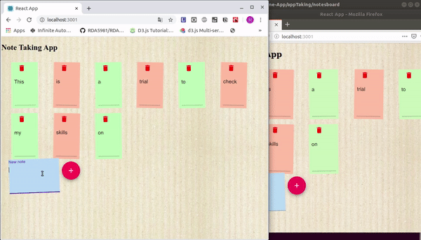

# Django-Notes-Real-Time-App

[](https://sonarcloud.io/dashboard?id=ManuelLecaro_Django-Notes-Real-Time-App)

## Note Takin Web App

This app works with Django on back and React on front in order to write, save, delete and update your post on real time with other people

### This is how it looks



### How to run
* In order to run this app you need:

1. [Python 3.x](https://www.python.org/downloads/)
2. [Node](https://nodejs.org/es/)
3. [Virtualenv](https://pypi.org/project/virtualenv/)
4. [yarn](https://classic.yarnpkg.com/es-ES/)

* Commands:
```
1. Inside notesboard run:
# yarn install
# yarn start
```
``` Django
2. Inside the directory run:
# source appenv/bin/activate
# python pip install requirements.txt
# python3.6 manage.py runserver 9000
```
``` Enter the app
```
3. Go to [the web app](http://localhost:3000/) and try it

